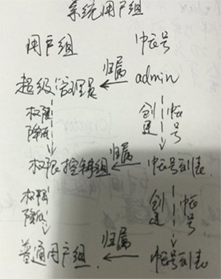

用户组管理
---
**用户组**是一个权限的容器，可以容纳权限值、账户。
相同用户组的人员拥有相同的权限分配。

所有的用户组都是平行关系

>   ### 一、系统用户组（系统自带）
>   * ##### 超级管理员（给超级管理员使用）
>           这个用户组包含了系统中所有的权限
>   * ##### 权限控制组
>           拥有仅次于超级管理员的权限（除了版本管理）
>   * ##### 普通用户组
>           仅包含个人中心权限
>
>   ### 二、自定义用户组
>       1、在权限控制组中的账号，可以自定义用户组
>       2、不同账号创建的用户组互不可见
>   
#
>   ### 三、用户组分配
>   1、系统用户组（参考下图） 
>              

### 更多
>   **权限管理**
>   *   [账户](docs/AuthUser.md)
>   *   [用户组](docs/AuthGroup.md)
>   *   [权限值](docs/AuthRule.md)
>   *   [数据权限](docs/Department.md)
>
>   **版本控制**
>   *   [版本](docs/Version.md)
>   *   [序列号](docs/License.md)
>
>   **菜单管理**
>   *   [菜单](docs/Menu.md)
>   *   [序列号](docs/License.md)